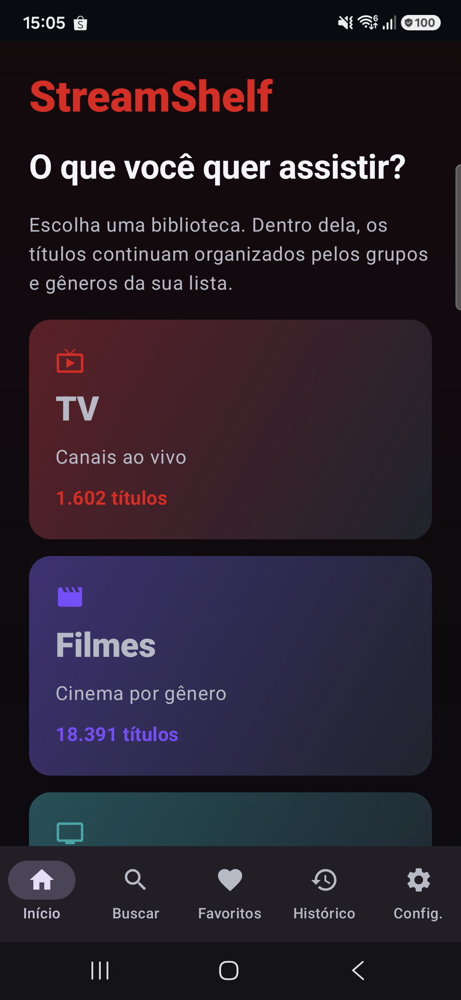
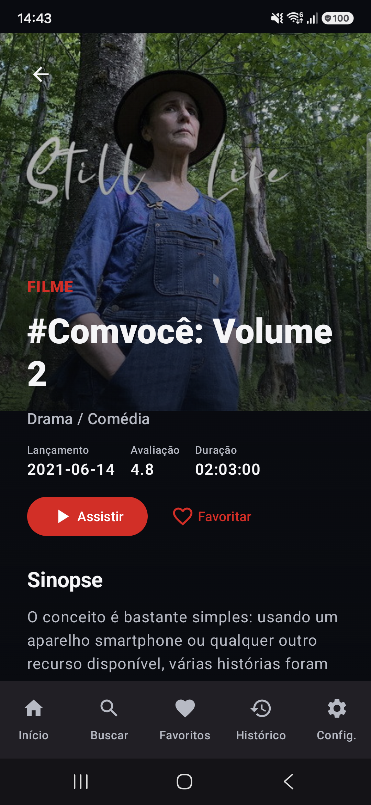
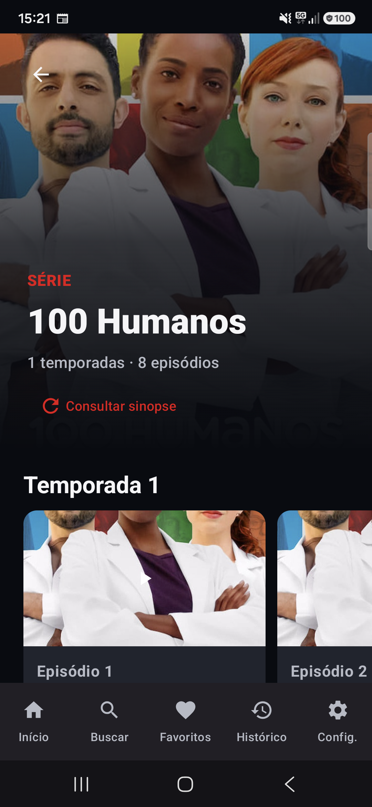

# StreamShelf

### Sua biblioteca de streaming organizada em um só lugar

O StreamShelf transforma listas M3U e M3U Plus em uma experiência visual para Android e Android TV. Canais ao vivo, filmes e séries ficam separados por categorias, com busca, favoritos, histórico e reprodução integrada.

  

## Conheça o aplicativo

  
  
  

## Recursos

- interface responsiva para celular, tablet e TV;
- canais ao vivo, filmes e séries organizados automaticamente;
- busca unificada;
- favoritos e histórico;
- progresso de reprodução;
- detalhes, temporadas e episódios;
- sincronização periódica das listas;
- proteção de conteúdo adulto com PIN;
- exportação e importação das listas;
- atualização segura pelo GitHub.

## Instalação

1. Abra a [versão mais recente](https://github.com/andiimdevlp/streamshelf-releases/releases/latest).
2. Baixe o arquivo `StreamShelf-x.y.z.apk`.
3. No Android, autorize a instalação para o aplicativo usado no download.
4. Confirme a instalação.

Requisitos:

- Android 8.0 ou mais recente;
- conexão com a internet;
- uma lista própria e autorizada compatível com M3U/M3U Plus.

## Atualizações

Quando houver uma versão mais nova, o StreamShelf avisa ao abrir. O APK é baixado somente do repositório oficial e passa por validações de tamanho, SHA-256, pacote, versão e certificado antes que o instalador do Android seja aberto.

O Android sempre pede a confirmação do usuário para concluir a instalação.

## Segurança do download

- baixe APKs somente da página oficial de [Releases](https://github.com/andiimdevlp/streamshelf-releases/releases);
- confira o arquivo `.sha256` disponibilizado junto ao APK;
- nunca instale versões enviadas por terceiros;
- releases publicadas não são substituídas silenciosamente.

## Importante

O StreamShelf é um reprodutor e organizador de mídia. O aplicativo não fornece, hospeda, vende ou inclui canais, filmes, séries ou listas. Cada usuário é responsável pelas fontes configuradas e por possuir autorização para acessar o conteúdo.

## Suporte

Ao relatar um problema, informe:

- modelo do aparelho;
- versão do Android;
- versão do StreamShelf;
- descrição do comportamento observado.

Não publique URLs de listas, usuários, senhas ou arquivos de backup.
